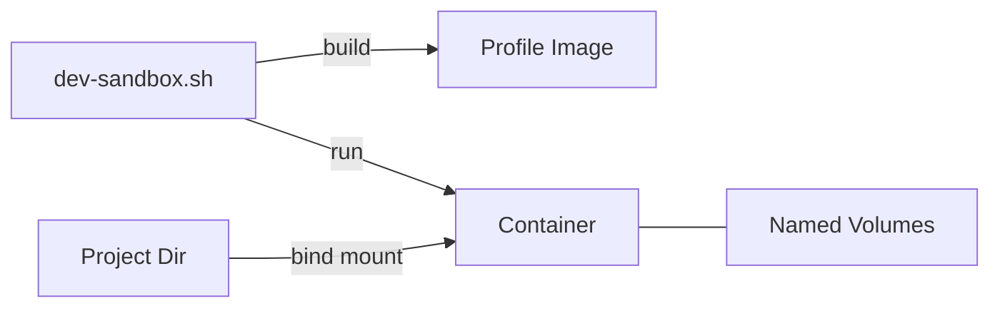

# dev-sandbox

**Run AI coding agents in isolated Podman containers, optionally with krun microVMs.**

For Linux distributions with Podman support. Developed and tested on Fedora 44.

One self-contained bash script. No dependencies beyond Podman. Configure profiles, build, run — everything in a single file.

## Why

AI coding agents need shell access and run arbitrary code. Without isolation:

- An agent can read `~/.ssh/`, `~/.aws/`, browser cookies, API keys
- A malicious pip package in `setup.py` can exfiltrate data silently
- Prompt injection in a file can instruct the agent to run destructive commands
- You have no visibility into what network connections the agent makes

dev-sandbox runs each agent in its own isolated environment with only the current project directory visible.

What this does **not** prevent: an agent can write to `.git/hooks` and persistent volumes, which execute on the next run. See [docs/SECURITY.md](docs/SECURITY.md).

## Quick start

```bash
# Install (Fedora/RHEL)
sudo dnf install podman crun-krun

# Install (Ubuntu/Debian)
sudo apt install podman

# Download
curl -o ~/.local/bin/dev-sandbox https://raw.githubusercontent.com/kosmrljt/dev-sandbox/main/dev-sandbox.sh
chmod +x ~/.local/bin/dev-sandbox

# Run from your project directory (only this directory is visible inside the sandbox)
cd ~/my-project
dev-sandbox                      # with krun (Fedora)
dev-sandbox --no-krun            # without krun (Ubuntu or any Linux)
```

The first run builds images (~1.6 GB, several minutes). Subsequent runs start in seconds. The default profile is configured for Claude Code — edit the script to change.

Once inside, you are in an isolated container:

```
[claude] /app/my-project--[HASH]$          ← colored prompt shows profile name
```

- You are user `dev`, not your host user
- Only your project directory is visible (mounted at `/app/...`)
- Your home directory, SSH keys, and other host files are not accessible
- pip packages, credentials, and config persist between sessions in named volumes
- Type `exit` to leave

## Profiles

Four built-in profiles with color-coded prompts. Each is isolated — separate volumes, credentials, and settings.

| Profile | Agent | Color | Description |
|---|---|---|---|
| `claude` (default) | Claude Code | Green |  |
| `research` | None (template) | Red | Add your own untrusted agents |
| `agy` | Antigravity | Yellow | Google AI agent |
| `vncgui` | GUI apps | Purple | VNC + XFCE desktop |

```bash
dev-sandbox                         # claude (default)
claude                              # start agent inside container

dev-sandbox -p agy                  # antigravity
agy                                 # start agent inside container

dev-sandbox -p research             # empty template, add your agents

dev-sandbox -p vncgui               # XFCE desktop
# On host: connect with VNC viewer (e.g. TigerVNC)
vncviewer localhost:5901            # password: sandbox
```

Show resolved settings for any profile:

```bash
dev-sandbox info                    # default profile
dev-sandbox -p research info        # specific profile
```

## Choosing a runtime

| Need | Runtime |
|---|---|
| VM isolation + firewall | krun, SSH off (auto-passt) |
| VM isolation + SSH terminal | krun (auto-TSI) or `--tsi` |
| VS Code Remote SSH | `--no-krun` |
| Firewall + SSH | `--no-krun` |

krun runs its own Linux kernel inside a microVM — a different isolation boundary than container namespaces. Standard container shares the host kernel but has full support for SSH tunneling and firewall.

Default is krun. Architecture details: [docs/ARCHITECTURE.md](docs/ARCHITECTURE.md).



## Usage examples

```bash
# All traffic through SOCKS proxy on host
dev-sandbox --proxy 1080

# No outbound traffic
dev-sandbox --net locked

# SSH for VS Code (requires --no-krun)
dev-sandbox --no-krun --ssh-port 2228 --ssh-key ~/.ssh/id_ed25519.pub

# Pass env from host (never in script or CLI history)
dev-sandbox --env ANTHROPIC_API_KEY

# Resource limits
dev-sandbox --ram 8192 --cpus 8
```

All flags: `dev-sandbox help`

## Configuration

Defaults apply to all profiles. Each profile only overrides what differs:

```bash
DEFAULT_USE_KRUN=true
DEFAULT_SSH_PORT=0
DEFAULT_COLOR="0"              # 31=red, 32=green, 33=yellow

PROFILE_claude_COLOR="32"      # Green — trusted

PROFILE_research_COLOR="31"    # Red — untrusted
PROFILE_research_SSH_PORT=0    # No SSH → passt → firewall works

ALL_PROFILES=(claude research agy vncgui)
```

Adding a new profile:

```bash
PROFILE_test_DESCRIPTION="My test sandbox"
PROFILE_test_COLOR="33"
ALL_PROFILES=(claude research agy vncgui test)
```

Settings resolve: CLI flag > Profile > Environment > Default.

Full configuration reference: [docs/CONFIGURATION.md](docs/CONFIGURATION.md).

## Requirements

- **Podman 4.x+** — `sudo dnf install podman` (Fedora/RHEL), `sudo apt install podman` (Ubuntu/Debian)
- **crun-krun** — optional, for krun microVM mode. Without it, use `--no-krun` for standard containers
- **passt** — usually installed with crun-krun

Optional: **gocryptfs** for encrypted directories, **btrfs** for quotas and snapshots.

## Known limitations

- **krun + SSH port mapping**: Does not work with passt networking. The script uses passt when firewall is active or SSH is off, TSI otherwise.
- **TSI connection bottleneck**: TSI stalls under many concurrent connections (e.g. loading a portal with many resources). This is why passt is preferred. Use `--tsi` only for testing.
- **No `podman exec` with krun**: Use SSH or tmux for additional terminals.
- **`.git/hooks`**: Bind-mounted project directory is writable. An agent can plant hooks that execute on the host. Review changes after sessions.
- **tty warning**: `tty: ttyname error` on krun startup is cosmetic.

## Related

[sockLight](https://github.com/kosmrljt/socklight) — SOCKS5 proxy with live terminal dashboard. Route sandbox traffic through it to see every connection and DNS query.

## License

MIT © Tomaž Košmrlj

Inspired by the [Fedora Magazine article on sandboxing AI agents with microVMs](https://fedoramagazine.org/sandbox-ai-coding-agents-with-microvms-on-fedora-linux/). Built through iterative pair programming with Claude (Anthropic).
