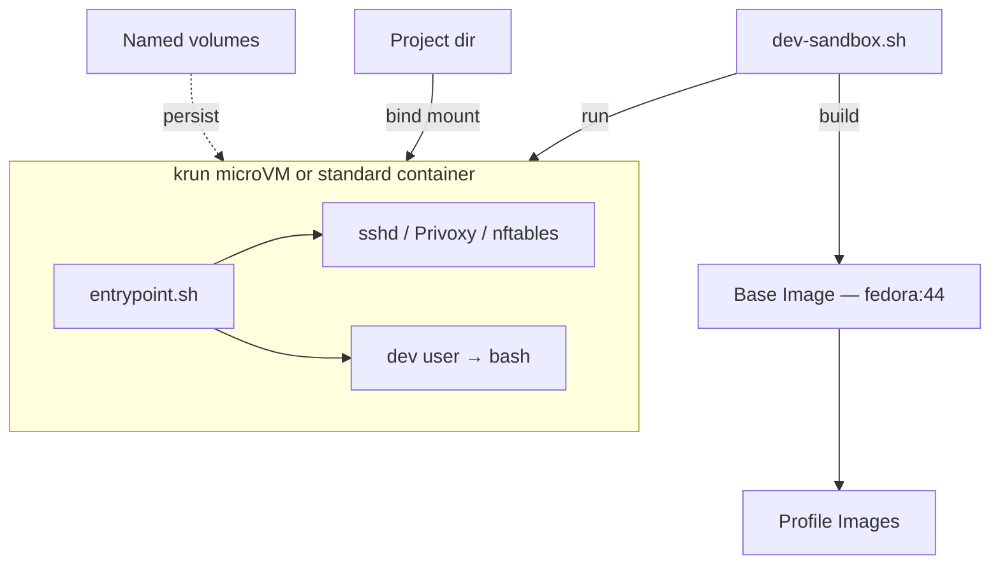

# Architecture

## System overview



Base image is built once and shared. Profile images add agent-specific packages on top. Layers are deduplicated.

## Network modes

| Mode | Effect |
|---|---|
| `--net open` (default) | Full internet access |
| `--net locked` | No outbound traffic, loopback only |
| `--allow [host:]port` | Only specified destinations, everything else blocked |
| `--proxy PORT` | All traffic through SOCKS proxy on host |

With `--allow`, nftables drops all outbound except loopback and allowed destinations. When Privoxy is enabled with `forward-socks5t`, DNS queries also go through the SOCKS proxy. Use `--allow-dns` to optionally allow direct DNS.

### Allow formats

```
--allow host.containers.internal:1080   Host + port
--allow :8000                           Port only (any destination)
--allow 8000                            Port only (short form)
--proxy 1080                            Shortcut: --allow + --run-privoxy + --privoxy-socks
```

## krun networking

Two networking modes are available with krun:

**TSI (Transparent Socket Impersonation)** — default when SSH is on. VMM intercepts socket system calls and proxies through the host. Fast, but nftables rules inside the VM have no effect. Stalls under many concurrent connections (~3 conn/s).

**Passt** — enabled automatically when SSH is off or firewall is active. Creates a virtual network interface (eth0) inside the VM. Traffic flows through the kernel's netfilter, so nftables works. Podman `-p` port mapping does not work with passt.

The script selects automatically:

| Condition | Networking |
|---|---|
| SSH off | passt |
| SSH on + open net | TSI |
| SSH on + firewall | passt (SSH port mapping disabled) |
| `--tsi` flag | TSI (forced) |

## krun microVM vs standard container

| | krun microVM | Standard container |
|---|---|---|
| Isolation | Own kernel (VM boundary) | Shared kernel (namespaces) |
| nftables firewall | Works with passt | Works natively |
| SSH terminal | TSI | Works |
| VS Code Remote SSH | Not supported | Works |
| `podman exec` | Not supported | Works |
| Overhead | ~200ms startup, fixed RAM | Minimal |

## Entrypoint sequence

1. Set sudo password from host-provided hash (unset hash after)
2. Fix volume ownership (skip `.` and `..`, chown `~/.local/etc`)
3. Generate defaults in rootconf volume (first run only): startup.sh, wrappers
4. Generate dev dotfiles in `~/.local/etc/` (first run only): bashrc.local, tmux.conf
5. Run root startup hook (`/etc/sandbox/startup.sh`)
6. Install command wrappers to `/usr/local/bin/`
7. Start sshd with `AllowTcpForwarding yes` (if configured)
8. Install SSH public key (if configured)
9. Start Privoxy (if configured)
10. Configure nftables firewall with conntrack (if configured)
11. Build custom env passthrough
12. Switch to dev user → bash

## Key Podman parameters

| Parameter | Purpose |
|---|---|
| `--annotation run.oci.handler=krun` | Use krun microVM |
| `--annotation krun.use_passt=1` | Passt networking |
| `--userns keep-id` | Map host UID to container UID |
| `--security-opt label=disable` | Disable SELinux labeling |
| `--cap-add NET_ADMIN` | Allow nftables (only when firewall needed) |
| `-v name:/path` | Named volume (persists) |
| `-v /host:/container` | Bind mount (project directory) |
| `-p 127.0.0.1:host:container` | Port mapping (SSH, localhost only) |
