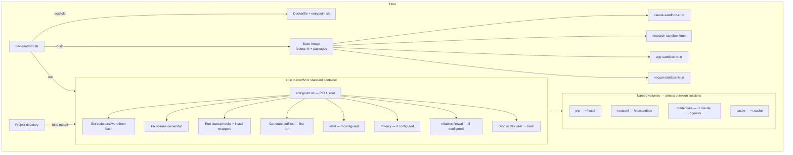
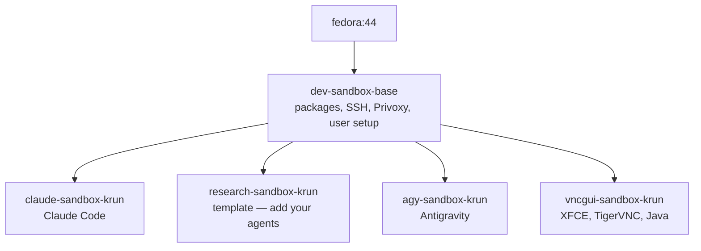
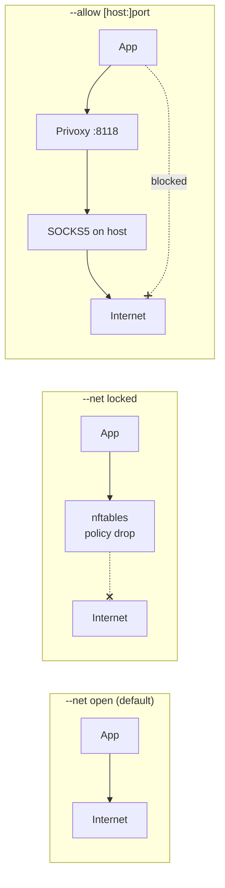
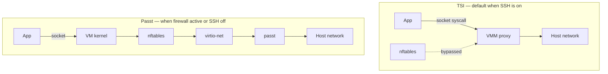

# Architecture

## System overview



## Image layers



Base image is built once and shared. Profile images add only agent-specific packages. Layers are deduplicated — total disk usage is much less than the sum of image sizes.

## Network modes



With `--allow`, nftables drops all outbound traffic except loopback and explicitly allowed destinations. When Privoxy is enabled with `forward-socks5t`, DNS queries also go through the SOCKS proxy — nothing leaks. Use `--allow-dns` to optionally allow direct DNS.

### Allow formats

```
--allow host.containers.internal:1080   Host + port
--allow :8000                           Port only (any destination)
--allow 8000                            Port only (short form)
```

## krun networking



### TSI (Transparent Socket Impersonation)

Default krun networking. VMM intercepts socket system calls and proxies them directly through the host. Fast, but nftables rules inside the VM have no effect — traffic never reaches the kernel network stack.

Limitation: stalls under many concurrent connections (~3 conn/s). Loading a web portal with many resources may hang.

### Passt

Creates a virtual network interface (eth0) inside the VM. Traffic flows through the kernel's netfilter, so nftables works. Automatically enabled when:

- SSH is off (no port mapping needed)
- Firewall is active (`--allow` or `--net locked`)

Limitation: Podman `-p` port mapping does not work with passt. SSH server inside the VM cannot be reached from the host.

Force TSI for testing: `dev-sandbox --tsi`

## krun microVM vs standard container

| | krun microVM | Standard container |
|---|---|---|
| Isolation | Own kernel (VM boundary) | Shared kernel (namespaces) |
| Networking | passt or TSI | Standard podman networking |
| nftables firewall | Works with passt | Works natively |
| SSH port mapping | TSI only (not passt) | Works |
| Container escape | Requires VM escape (hard) | Requires namespace escape (easier) |
| `podman exec` | Not supported | Works |
| Overhead | ~200ms startup, fixed RAM | Minimal |

## Entrypoint sequence

1. Set sudo password from host-provided hash
2. Fix volume ownership (skip `.` and `..`)
3. Generate defaults in rootconf volume (first run only)
4. Run root startup hook (`/etc/sandbox/startup.sh`)
5. Install command wrappers to `/usr/local/bin/`
6. Generate dev dotfiles in `~/.local/etc/` (first run only)
7. Start sshd (if configured)
8. Start Privoxy (if configured)
9. Configure nftables firewall (if configured)
10. Switch to dev user → bash

## Key Podman parameters

| Parameter | Purpose |
|---|---|
| `--annotation run.oci.handler=krun` | Use krun microVM runtime |
| `--annotation krun.ram_mib=N` | VM memory limit in MiB |
| `--annotation krun.cpus=N` | VM CPU cores |
| `--annotation krun.use_passt=1` | Use passt networking |
| `--userns keep-id` | Map host UID to container UID 1:1 |
| `--security-opt label=disable` | Disable SELinux labeling |
| `--cap-add NET_ADMIN` | Allow firewall rules (only when needed) |
| `--tmpfs /path:opts` | RAM-backed filesystem (cleared on exit) |
| `-v name:/path` | Named volume (persists between runs) |
| `-v /host/path:/path` | Bind mount (project directory) |
| `-p host:container` | Port mapping (SSH server) |
